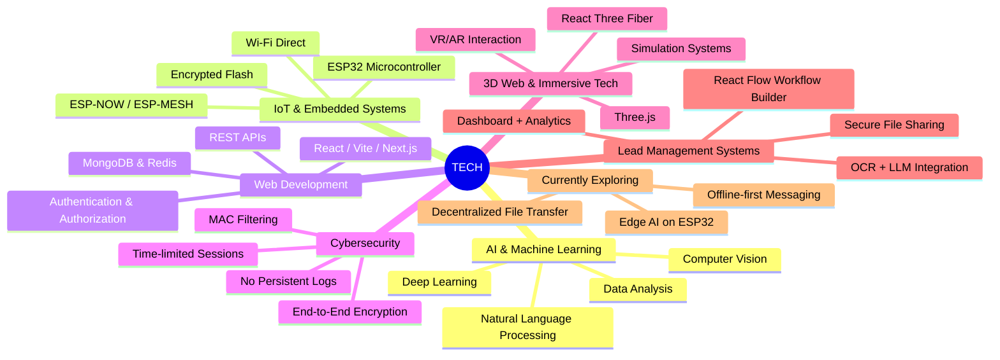

<h1 align="center">Hi 👋, I'm Vishnu Jillala</h1>
<h3 align="center">Aspiring Full Stack Developer | AI & ML Enthusiast</h3>

---

### 👨‍💻 **About Me** 
- 🎓 B.Tech in CSE, Woxsen University (2022–2026)
- 🚀 Passionate about building scalable web apps and AI-integrated systems
- 🔐 Currently exploring **ESP32 Wi-Fi Direct**, **Mesh Networking**, and **Blockchain Security**
- 🛠️ Hands-on with **AI/ML**, Full-stack development, and secure web solutions

---

<h3>👨‍💻 My Coding Journey</h3>

I started my coding journey as a curious learner with a strong interest in how technology could solve real-world problems. From tinkering with code to building full-stack applications, I slowly shaped my path into becoming a developer who thrives on innovation and hands-on implementation.

While exploring web development using React, Node.js, and Python, I also got deeply involved in AI/ML and IoT. One of my most exciting projects is developing a **Wi-Fi Direct USB device using ESP32**, enabling **offline, encrypted, one-to-one communication** with **mesh networking**. It's more than just a device — it's a step toward creating secure, decentralized, peer-to-peer networks.

Along the way, I’ve worked on impactful projects like a **Mini-CRM system at PCGroup.ai**, involving OCR, lead pipelines, AI workflows, and seamless UI/UX using React Flow and Tailwind.

Every challenge pushes me further — from building 3D e-commerce sites to deploying microservices with Docker and Redis. Whether it’s full-stack development, real-time data handling, or system security, I believe in constantly learning and delivering solutions that matter.

🚀 The journey’s just beginning — and I’m ready for what’s next.

---

### 🧰 Languages and Tools

  
  
  
  
  
  
  
  
    

  
  
  
  
  
    

  
  
  
  
  

---

### 🌟 Tech Field

---

### 💼 Key Projects

- **🔐 AI in Cyber Security Threat Detection**  
  Phishing detection using ML analyzing 50+ threat indicators  
  [GitHub Repo](https://github.com/code-with-vishnu26/Applicative-project--SEM-6.git)

- **🔒 Secure Password Management Using Blockchain**  
  Private key storage, end-to-end encryption, smart contracts  
  [GitHub Repo](https://github.com/code-with-vishnu26/Applicative-Project-SEM-5.git)

- **🌐 Full-Stack Template (Next.js + Express/NestJS)**  
  SSR, Docker-based deployment, socket.io & JWT auth  
  [GitHub Repo](https://github.com/code-with-vishnu26/fullstack-nextjs-app-template-main.git)

- **🛡 Web Vulnerability Scanner**  
  80+ security tests automated with tools like Nmap, Nikto  
  [GitHub Repo](https://github.com/code-with-vishnu26/Web-Vulnerability-Scanner.git)

---

### 🏅 Certifications
- 📊 Data Structures – UC San Diego  
- 🛢️ Database Management – University of Colorado  
- 💻 Web Dev – UCDAVIS  
- 🌐 TechVortex 2.0 – International Project Competition  
- 🛍️ Flipkart GRID 6.0 – E-Commerce & Tech Quiz  
- 📈 Forage – Data Analytics Job Simulation

---

### 🏆 Achievements
- 🥇 2025 March – 1st Place, DIGITECH Hackathon  
  Ranked #1 among 50+ teams for **AI Resume Ranker**

---

### 🧠 Fun Fact
> I love reverse-engineering products just to rebuild them smarter 😄

---

### 📎 Extras

- 📁 Portfolio: [My Portfolio](https://yourportfolio.link)
- 📄 Resume: [View Resume](https://linktoresume.pdf)

### 🔥 GitHub Stats and Activity

  
  
  

---

### 🤝 Connect & Collaborate

  
  
  
  
  

---

  

  

